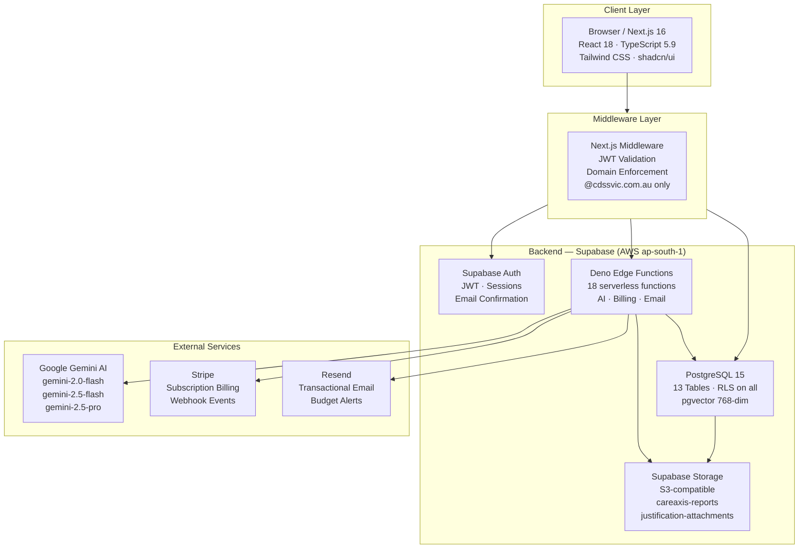

<div align="center">

# CareAxis

### Enterprise NDIS Platform for Support Coordinators and Plan Managers

[](https://github.com/jennofrie/CareAxis/releases)
[](https://nextjs.org/)
[](https://react.dev/)
[](https://www.typescriptlang.org/)
[](https://supabase.com/)
[](https://tailwindcss.com/)
[](./LICENSE)

<br/>

> A secure, multi-tenant B2B SaaS platform built to streamline NDIS planning, reporting, compliance, and budget management workflows — powered by Google Gemini AI.

**Designed and maintained by [JD Digital Systems](https://github.com/jennofrie/CareAxis)**

</div>

---

## Table of Contents

- [Overview](#overview)
- [System Architecture](#system-architecture)
- [User Workflows](#user-workflows)
- [Feature Suite](#feature-suite)
- [Built With](#built-with)
- [Project Structure](#project-structure)
- [Database Schema](#database-schema)
- [Edge Functions](#edge-functions)
- [Storage](#storage)
- [Environment Variables](#environment-variables)
- [Getting Started](#getting-started)
- [Deployment](#deployment)
- [Security](#security)
- [Contributing](#contributing)
- [License](#license)

---

## Overview

CareAxis is a purpose-built enterprise platform for NDIS service providers. It delivers AI-assisted workflows across the full support coordination lifecycle — from participant onboarding and plan analysis through to compliance reporting and budget forecasting.

| Property | Value |
|---|---|
| **Version** | 2.1.0 |
| **Target Users** | NDIS support coordinators, plan managers, senior planners |
| **Access Control** | Restricted to `@cdssvic.com.au` email domain |
| **Infrastructure Region** | AWS ap-south-1 (Supabase) |
| **Development Port** | 3001 |
| **Authentication** | Supabase Auth with JWT sessions |

---

## System Architecture



---

## User Workflows

```mermaid
flowchart TD
    A([User visits CareAxis]) --> B{Authenticated?}
    B -- No --> C[/auth Sign In / Sign Up]
    C --> D{Email domain\n@cdssvic.com.au?}
    D -- No --> E[Access Denied\nRedirect to /auth]
    D -- Yes --> F[JWT issued\nSession established]
    B -- Yes --> F

    F --> G[Dashboard]

    G --> H[Report Synthesizer\nAI multi-source synthesis]
    G --> I[Budget Forecaster\nProjections + alerts]
    G --> J[Roster Analyzer\nVic penalty rates]
    G --> K[Justification Drafter\nAI-generated evidence]
    G --> L[RAG Agent\npgvector semantic search]
    G --> M[Senior Planner\nAudit + CoC assessment]
    G --> N[QuantumSign\nE-signature workflow]
    G --> O[Plan Management Expert\nAI analytics]

    H --> P{Export?}
    I --> P
    J --> P
    K --> P
    P -- PDF --> Q[jsPDF export\nDownload to browser]
    P -- CSV --> R[PapaParse export\nDownload to browser]

    N --> S[Send Signature Request\nvia Resend email]
    S --> T[Recipient signs at\n/sign/{token}]
    T --> U[PDF merged via pdf-lib\nStatus: SIGNED]

    L --> V[Document Ingestion\nChunk + embed via Gemini]
    V --> W[768-dim vectors\nStored in pgvector]
    W --> X[Cosine similarity search\nGrounded Gemini response]
```

---

## Feature Suite

CareAxis ships 14 purpose-built tools for NDIS service providers:

| # | Tool | Description | Persistence |
|---|------|-------------|-------------|
| 1 | **Dashboard** | Activity overview, quick navigation, subscription status | — |
| 2 | **Report Synthesizer** | AI synthesis of NDIS progress and functional reports | `synthesized_reports` |
| 3 | **Senior Planner** | Senior planner audit with dual history and CoC integration | `synthesized_reports` + `coc_assessments` |
| 4 | **Plan Management Expert** | AI-powered plan management analytics with query history | `plan_management_queries` |
| 5 | **CoC Cover Letter Generator** | Circle of Care cover letter generation with server-side caching | `coc_cover_letter_history` |
| 6 | **CoC Eligibility Assessor** | Structured Circle of Care eligibility assessment | `coc_assessments` |
| 7 | **Justification Drafter** | NDIS funding justification generator with file attachment support | `justification-attachments` bucket |
| 8 | **Budget Forecaster** | Forward-looking budget projections with CSV export and threshold alerts | `budgets` + `budget_snapshots` |
| 9 | **Roster Analyzer** | Roster analysis with Victoria penalty rate toggle, CSV and PDF export | — |
| 10 | **Visual Case Notes** | Rich case note editor with pagination | `localStorage` |
| 11 | **Weekly Summary** | Automated weekly summary report generation | `localStorage` |
| 12 | **RAG Agent** | AI chatbot with retrieval-augmented generation via pgvector | `rag_agent_conversations` + `rag_agent_sessions` |
| 13 | **QuantumSign** | End-to-end e-signature system with PDF rendering, click-to-place signatures, and email notifications | `signature_requests` |
| 14 | **Watch Demo** | Guided product walkthrough for new users | — |

### Core Capabilities

- **AI-Assisted Document Generation** — Powered by Google Gemini models across three capability tiers for intelligent NDIS documentation
- **Budget Forecasting and Alerts** — Predictive utilisation modelling with configurable threshold alerts via Resend
- **Roster Penalty Rate Analysis** — Victoria-specific Fair Work Act penalty rate toggle with CSV and PDF export
- **Retrieval-Augmented Generation** — 768-dimensional pgvector embeddings with cosine similarity search for grounded AI responses
- **QuantumSign E-Signatures** — Full document signing lifecycle: request, track, sign, merge (pdf-lib), and audit trail
- **Client-Side PDF Export** — All major reports exportable to PDF via jsPDF and jspdf-autotable with branded headers
- **History Panels** — Per-feature history with caching, pagination, and Supabase-backed persistence
- **Theme Support** — Full dark and light theme via ThemeProvider and next-themes
- **Animated Loading States** — 50 NDIS-specific tips with per-feature status messages during AI generation

---

## Built With

### Frontend

| Technology | Version | Purpose |
|---|---|---|
| [Next.js](https://nextjs.org/) | 16 | App Router, SSR, React Server Components |
| [React](https://react.dev/) | 18 | UI component framework |
| [TypeScript](https://www.typescriptlang.org/) | 5.9 | Full-stack type safety |
| [Tailwind CSS](https://tailwindcss.com/) | 4 | Utility-first styling |
| [shadcn/ui](https://ui.shadcn.com/) | latest | Accessible UI primitives |
| [Radix UI](https://www.radix-ui.com/) | latest | Headless component foundation |
| [Recharts](https://recharts.org/) | 2.15 | Declarative charting (Budget Forecaster) |
| [Chart.js](https://www.chartjs.org/) | 4.4 | Data visualisation |
| [jsPDF](https://github.com/parallax/jsPDF) | 3.0 | Client-side PDF generation |
| [jspdf-autotable](https://github.com/simonbengtsson/jsPDF-AutoTable) | 5.0 | PDF table rendering |
| [PapaParse](https://www.papaparse.com/) | 5.5 | CSV parsing and export |
| [pdf-lib](https://pdf-lib.js.org/) | 1.17 | Server-side PDF merging (QuantumSign) |
| [pdfjs-dist](https://mozilla.github.io/pdf.js/) | 5.4 | PDF rendering in browser |
| [react-signature-canvas](https://github.com/agilgur5/react-signature-canvas) | 1.1 | Signature drawing pad |
| [TanStack Query](https://tanstack.com/query) | 5.90 | Async state management |
| [Sonner](https://sonner.emilkowal.ski/) | 1.7 | Toast notifications |
| [Lucide React](https://lucide.dev/) | 0.575 | Icon library |
| [@tsparticles/react](https://particles.js.org/) | 3.0 | Particle background animation |
| [Zod](https://zod.dev/) | 3.25 | Schema validation |

### Backend

| Technology | Details |
|---|---|
| [Supabase](https://supabase.com/) | Project `jlxfahqfmahrlztiedyd` — AWS ap-south-1 |
| PostgreSQL 15 | Primary database with Row Level Security on all 13 tables |
| [pgvector](https://github.com/pgvector/pgvector) | 768-dimensional vector embeddings (installed in `extensions` schema) |
| Supabase Auth | JWT-based authentication with domain restriction enforcement |
| Deno Edge Functions | 18 serverless functions for AI processing, billing, and email |
| Supabase Storage | S3-compatible file storage for reports and attachments |

### AI Models

| Model | Use Case |
|---|---|
| `gemini-2.0-flash` | Image analysis, visual case notes, weekly summaries |
| `gemini-2.5-flash-preview-05-20` | Text analysis, justification drafting, plan management |
| `gemini-2.5-pro` | Senior Planner audit (highest-capability reasoning) |
| Gemini Embeddings API | 768-dimensional vector generation for RAG |

### Integrations

| Service | Purpose |
|---|---|
| [Stripe](https://stripe.com/) | Subscription billing, webhook handling |
| [Resend](https://resend.com/) | Transactional email — alerts, QuantumSign notifications |

---

## Project Structure

```
CareAxis/
├── app/                              # Next.js 16 App Router
│   ├── (authenticated)/              # Protected route group (session required)
│   │   ├── layout.tsx                # Session guard, sidebar, navigation
│   │   ├── dashboard/
│   │   ├── report-synthesizer/
│   │   ├── senior-planner/
│   │   ├── plan-management-expert/
│   │   ├── coc-cover-letter/
│   │   ├── coc-eligibility-assessor/
│   │   ├── justification-drafter/
│   │   ├── budget-forecaster/
│   │   ├── roster-analyzer/
│   │   ├── visual-case-notes/
│   │   ├── weekly-summary/
│   │   ├── rag-agent/
│   │   ├── quantum-sign/
│   │   └── watch-demo/
│   ├── auth/                         # Sign in / sign up pages
│   └── auth/callback/
│       └── route.ts                  # Email confirmation route handler
├── components/
│   ├── layout/                       # Header, Sidebar navigation
│   ├── providers/                    # ThemeProvider
│   ├── quantum-sign/                 # 11 QuantumSign-specific components
│   └── ui/                           # shadcn/ui components
│       ├── GeneratingOverlay.tsx     # Animated AI loading overlay (50 tips)
│       ├── Sheet.tsx                 # Slide-over panel primitive
│       └── ...                       # Button, Card, Dialog, Input, etc.
├── hooks/                            # Custom React hooks
│   └── useSignatureRequests.ts       # TanStack Query hook for QuantumSign
├── lib/
│   ├── supabase/
│   │   ├── client.ts                 # Browser-side Supabase client
│   │   ├── server.ts                 # Server-side Supabase client
│   │   └── middleware.ts             # Auth middleware + domain enforcement
│   ├── pdfExport.ts                  # Core PDF export utilities
│   ├── pdfExportFeatures.ts          # 8 feature-specific PDF exporters
│   ├── rosterExport.ts               # Roster CSV and PDF export logic
│   └── victoriaHolidays.ts           # Victoria public holiday definitions
├── supabase/
│   ├── config.toml                   # Supabase project configuration
│   ├── migrations/                   # 20 SQL migration files (fully synced)
│   └── functions/                    # 18 Deno edge functions
├── docs/
│   ├── ARCHITECTURE.md               # System architecture deep-dive
│   ├── DEPLOYMENT.md                 # Deployment guide
│   └── EDGE_FUNCTIONS.md             # Edge function reference
├── .env.example                      # Environment variable template
├── next.config.ts
├── tailwind.config.ts
├── tsconfig.json
└── package.json
```

---

## Database Schema

CareAxis uses 13 PostgreSQL tables, all with Row Level Security (RLS) enabled and enforced at the database level.

| Table | Purpose |
|---|---|
| `profiles` | User profiles linked to Supabase Auth (`id`, `subscription_tier`, timestamps) |
| `budgets` | NDIS budget records per participant — support categories, allocated and spent amounts |
| `budget_snapshots` | Point-in-time budget snapshots for forecasting and audit history |
| `report_audits` | Audit log for all generated reports (who, when, parameters) |
| `plan_management_queries` | Plan Management Expert query and response history |
| `rag_agent_conversations` | Individual RAG agent conversation messages |
| `rag_agent_sessions` | RAG agent session groupings |
| `activity_logs` | System-wide activity and event audit trail |
| `cases` | NDIS participant case records (participant info, goals, plan dates) |
| `coc_assessments` | Circle of Care eligibility assessment results |
| `synthesized_reports` | Report Synthesizer and Senior Planner AI outputs |
| `coc_cover_letter_history` | CoC cover letter history with server-side caching |
| `document_embeddings` | pgvector 768-dimensional document embeddings for RAG retrieval |

### pgvector Convention

The pgvector extension is installed in the `extensions` schema. All vector columns must be declared as:

```sql
-- Correct
embeddings extensions.vector(768)

-- Do not use — causes migration failures
embeddings vector(768)
```

---

## Edge Functions

CareAxis deploys 18 Deno edge functions to Supabase:

| # | Function | Auth | AI Model | Purpose |
|---|---|---|---|---|
| 1 | `analyze-image` | No | Gemini 2.0-flash | Image analysis for case note attachments |
| 2 | `analyze-text` | No | Gemini 2.5-flash | General text analysis |
| 3 | `analyze-roster` | Yes | Gemini | Roster analysis with Victoria penalty rates |
| 4 | `coc-cover-letter-generator` | No | Gemini | Circle of Care cover letter generation |
| 5 | `coc-eligibility-assessor` | Yes | Gemini | Circle of Care eligibility determination |
| 6 | `extract-plan-data` | Yes | Gemini | NDIS plan PDF data extraction |
| 7 | `forecast-budget` | No | Gemini | Budget forecasting and anomaly detection |
| 8 | `generate-embedding` | Yes | Gemini Embeddings | 768-dim vector embedding generation |
| 9 | `generate-justification` | Yes | Gemini 2.5-flash | NDIS support justification drafting |
| 10 | `generate-weekly-summary` | Yes | Gemini 2.0-flash | Weekly summary report generation |
| 11 | `plan-management-expert` | Yes | Gemini | Plan management analytics and advice |
| 12 | `rag-agent` | Yes | Gemini + pgvector | RAG chatbot with document retrieval |
| 13 | `send-budget-alert` | Yes | — | Budget threshold alert emails via Resend |
| 14 | `senior-planner-audit` | Yes | Gemini 2.5-pro | Comprehensive senior planner audit |
| 15 | `suggest-goal-alignment` | Yes | Gemini | NDIS goal alignment suggestions |
| 16 | `synthesize-report` | No | Gemini | Multi-source NDIS report synthesis |
| 17 | `quantum-sign` | Yes | — | Authenticated signature request CRUD |
| 18 | `quantum-sign-public` | No | — | Token-based public document signing |

For detailed per-function request/response schemas, see [docs/EDGE_FUNCTIONS.md](./docs/EDGE_FUNCTIONS.md).

---

## Storage

| Bucket | Visibility | Purpose |
|---|---|---|
| `justification-attachments` | Private | Supporting documents uploaded via Justification Drafter |
| `careaxis-reports` | Private | Generated PDF reports and exports |

Both buckets enforce ownership-scoped access policies. Public access is disabled.

---

## Environment Variables

### Application (`.env`)

```env
NEXT_PUBLIC_SUPABASE_URL=https://jlxfahqfmahrlztiedyd.supabase.co
NEXT_PUBLIC_SUPABASE_ANON_KEY=your_anon_key_here
NEXT_PUBLIC_APP_VERSION=2.1.0
NEXT_PUBLIC_STRIPE_PREMIUM_LINK=https://buy.stripe.com/your_link
```

### Supabase Edge Function Secrets

Configure via `supabase secrets set` or the Supabase Dashboard:

```bash
supabase secrets set GEMINI_API_KEY=your_gemini_api_key
supabase secrets set STRIPE_SECRET_KEY=your_stripe_secret_key
supabase secrets set STRIPE_WEBHOOK_SECRET=your_stripe_webhook_secret
supabase secrets set RESEND_API_KEY=your_resend_api_key
supabase secrets set SUPABASE_SERVICE_ROLE_KEY=your_service_role_key
```

> The `SUPABASE_SERVICE_ROLE_KEY` bypasses all RLS policies. It must only ever exist as a Supabase edge function secret — never in `.env` or any client-accessible context.

Copy `.env.example` to `.env` and populate all values before starting the application.

---

## Getting Started

### Prerequisites

| Tool | Version |
|---|---|
| Node.js | 20 LTS or higher |
| npm | Bundled with Node.js 20+ |
| Supabase CLI | v2.75.0 or higher |
| Git | Any recent stable version |

Install the Supabase CLI:

```bash
npm install -g supabase
```

### Local Development Setup

**1. Clone the repository**

```bash
git clone https://github.com/jennofrie/CareAxis.git
cd CareAxis
```

**2. Install dependencies**

```bash
npm install
```

**3. Configure environment variables**

```bash
cp .env.example .env
# Populate NEXT_PUBLIC_SUPABASE_URL and NEXT_PUBLIC_SUPABASE_ANON_KEY
```

**4. Link to the Supabase project**

```bash
supabase login
supabase link --project-ref jlxfahqfmahrlztiedyd
```

**5. Enable pgvector extension**

In the Supabase Dashboard under **Database → Extensions**, enable `vector` (pgvector) before running migrations.

**6. Apply database migrations**

```bash
supabase db push
```

Applies all 20 SQL migrations to the remote project.

**7. Deploy edge functions**

```bash
supabase functions deploy
```

Deploys all 18 Deno edge functions.

**8. Set edge function secrets**

```bash
supabase secrets set GEMINI_API_KEY=your_value
supabase secrets set STRIPE_SECRET_KEY=your_value
supabase secrets set STRIPE_WEBHOOK_SECRET=your_value
supabase secrets set RESEND_API_KEY=your_value
supabase secrets set SUPABASE_SERVICE_ROLE_KEY=your_value
```

**9. Start the development server**

```bash
npm run dev
```

The application runs at [http://localhost:3001](http://localhost:3001).

---

## Deployment

### Production Build

```bash
npm run build
npm start
```

### Vercel (Recommended)

```bash
vercel deploy
```

Add the following environment variables in the Vercel Dashboard:

- `NEXT_PUBLIC_SUPABASE_URL`
- `NEXT_PUBLIC_SUPABASE_ANON_KEY`
- `NEXT_PUBLIC_APP_VERSION`
- `NEXT_PUBLIC_STRIPE_PREMIUM_LINK`

### Pre-Launch Checklist

- [ ] pgvector extension enabled under the `extensions` schema
- [ ] All 20 migrations applied — `supabase db diff` returns empty output
- [ ] All 18 edge functions deployed
- [ ] All 5 edge function secrets set — `supabase secrets list` shows all keys
- [ ] RLS enabled on all 13 tables
- [ ] Storage buckets `justification-attachments` and `careaxis-reports` created (private)
- [ ] Stripe webhook endpoint configured for `checkout.session.completed`, `customer.subscription.updated`, `customer.subscription.deleted`
- [ ] Auth site URL and redirect URLs configured in the Supabase Dashboard

For the complete deployment walkthrough, see [docs/DEPLOYMENT.md](./docs/DEPLOYMENT.md).

---

## Security

CareAxis is built with layered security controls appropriate for handling sensitive NDIS participant data:

- **Row Level Security** — All 13 database tables enforce `auth.uid() = user_id` policies at the PostgreSQL level
- **JWT Authentication** — All protected routes and edge functions validate Supabase-issued JWTs server-side
- **Domain Restriction** — Middleware enforces `@cdssvic.com.au` email domain on every request before reaching application logic
- **Secret Isolation** — All sensitive credentials (Gemini, Stripe, Resend, service role key) are stored exclusively in the Supabase secrets manager, never in source code or `.env`
- **Storage Policies** — Both storage buckets restrict access to authenticated users with matching ownership

See [SECURITY.md](./SECURITY.md) for the full security policy and vulnerability disclosure process.

---

## Contributing

CareAxis is proprietary software maintained by **JD Digital Systems**. External contributions require prior written agreement.

For bug reports and feature requests, open an issue at [github.com/jennofrie/CareAxis/issues](https://github.com/jennofrie/CareAxis/issues).

See [CONTRIBUTING.md](./CONTRIBUTING.md) for branch conventions, commit message format, code style guidelines, and the PR process.

---

## License

Copyright &copy; 2026 JD Digital Systems. All rights reserved.

This software is proprietary and confidential. Unauthorised copying, distribution, modification, or use of this software — via any medium — is strictly prohibited without the express written permission of JD Digital Systems.

---

<div align="center">

**CareAxis v2.1.0**

Built and maintained by [JD Digital Systems](https://github.com/jennofrie/CareAxis)

*Empowering NDIS service providers with enterprise-grade tools*

</div>
