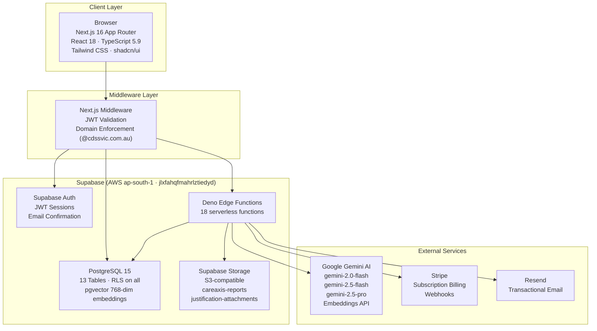
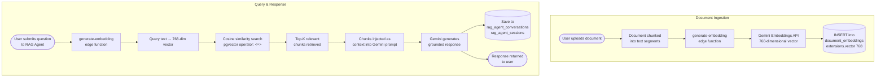

# CareAxis — Architecture Overview

> Maintained by **JD Digital Systems** — [github.com/jennofrie/CareAxis](https://github.com/jennofrie/CareAxis)
> Last updated: May 2026

---

## Table of Contents

1. [System Architecture Diagram](#system-architecture-diagram)
2. [Tech Stack](#tech-stack)
3. [App Router Structure](#app-router-structure)
4. [Authentication Flow](#authentication-flow)
5. [Database Schema](#database-schema)
6. [Edge Functions Architecture](#edge-functions-architecture)
7. [RAG Pipeline](#rag-pipeline)
8. [PDF Export Architecture](#pdf-export-architecture)
9. [Subscription Tiers](#subscription-tiers)
10. [Key Design Decisions](#key-design-decisions)

---

## System Architecture Diagram



---

## Tech Stack

### Frontend

| Technology | Version | Purpose |
|---|---|---|
| Next.js (App Router) | 15 | Full-stack React framework, SSR, RSC |
| React | 19 | UI component library |
| TypeScript | 5.7 | Type safety across the codebase |
| Tailwind CSS | 3.4 | Utility-first CSS framework |
| shadcn/ui | latest | Accessible, composable UI primitives |
| sonner | latest | Toast notification system |
| recharts | latest | Chart rendering (Budget Forecaster) |
| jsPDF + jspdf-autotable | latest | Client-side PDF generation |
| papaparse | latest | CSV parsing and export |

### Backend

| Technology | Details |
|---|---|
| Supabase | Project ID: `jlxfahqfmahrlztiedyd` (AWS ap-south-1) |
| PostgreSQL | Version 15, hosted on Supabase |
| Row Level Security (RLS) | Enforced on all 13 tables |
| Deno Edge Functions | 16 functions deployed to Supabase |

### AI / ML

| Model | Use Case |
|---|---|
| `gemini-2.0-flash` | Image analysis, visual case notes, quick summaries |
| `gemini-2.5-flash-preview-05-20` | Text generation, justification drafting, plan management |
| `gemini-2.5-pro` | Senior Planner Audit (highest-quality reasoning) |
| Gemini Embeddings | 768-dimensional vectors for RAG document search |

### Payments

- **Stripe**: subscription billing, webhook handling via Edge Function

### Email

- **Resend**: transactional email (auth confirmations, notifications)

### Storage

- **Supabase Storage** (S3-compatible):
  - `careaxis-reports` — generated PDF reports
  - `justification-attachments` — uploaded participant documents

---

## App Router Structure

```
app/
├── layout.tsx                    # Root layout — Toaster, providers
├── page.tsx                      # Landing / redirect
├── auth/
│   ├── page.tsx                  # Sign in / Sign up page
│   └── callback/
│       └── route.ts              # Email confirmation deep link handler
└── (authenticated)/              # Route group — all protected routes
    ├── layout.tsx                # Session guard, sidebar, nav
    ├── dashboard/
    ├── budget-forecaster/
    ├── justification-drafter/
    ├── roster-analyzer/
    ├── report-synthesizer/
    ├── plan-management-expert/
    ├── visual-case-notes/
    ├── weekly-summary/
    ├── coc-cover-letter/
    ├── coc-assessor/
    ├── senior-planner/
    └── rag-agent/
```

**Public routes** (no session required): `/`, `/auth`, `/auth/callback`

**Protected routes** (session required): everything under `(authenticated)/`

---

## Authentication Flow

```mermaid
flowchart TD
    A([User visits protected route]) --> B{Session cookie present?}
    B -- No --> C[Redirect to /auth]
    C --> D[User submits credentials]
    D --> E[Supabase Auth validates\nemail + password]
    E --> F[JWT issued\nStored in httpOnly cookie]
    F --> G{Email domain check\nmiddleware.ts}
    B -- Yes --> G
    G -- "@cdssvic.com.au" --> H[Request forwarded\nRoute renders with session]
    G -- "Other domain" --> I[Redirect to /auth\nAccess denied]

    subgraph NewUser["New User — Email Confirmation"]
        J[Supabase sends\nconfirmation email] --> K[User clicks link]
        K --> L[/auth/callback/route.ts\nexchanges code for session]
        L --> M[Redirect to /dashboard]
    end
```

**Domain restriction**: only `@cdssvic.com.au` email addresses are permitted. This is enforced in `middleware.ts` on every request, server-side.

---

## Database Schema

13 tables, all with Row Level Security (RLS) enforced.

### Core Tables

#### `profiles`
Extends Supabase Auth `auth.users`. Created automatically on sign-up via database trigger.

| Column | Type | Notes |
|---|---|---|
| `id` | `uuid` | FK → `auth.users.id`, PK |
| `subscription_tier` | `text` | `free` or `premium` |
| `created_at` | `timestamptz` | |
| `updated_at` | `timestamptz` | |

#### `budgets`
NDIS budget tracking per participant.

- Linked to `profiles` via `user_id`
- Stores support categories, allocated amounts, spent amounts

#### `budget_snapshots`
Point-in-time copies of budget state.

- Preserved on budget delete (for audit history)
- Linked to `budgets`

#### `cases`
NDIS participant case records.

- Stores participant info, goals, functional impairments, plan start/end dates
- Linked to `profiles` (case manager)

### AI Feature Tables

#### `synthesized_reports`
Stores AI-generated synthesis reports.

- Used by: Report Synthesizer, Senior Planner Audit
- Columns: `user_id`, `title`, `content`, `created_at`

#### `report_audits`
Audit log for generated reports (who generated, when, parameters used).

#### `coc_assessments`
Change of Circumstances eligibility assessment results.

- Used by: CoC Eligibility Assessor, Senior Planner Audit

#### `coc_cover_letter_history`
Generated CoC cover letters with caching.

- Cache prevents duplicate generation for identical inputs
- Columns: `user_id`, `input_hash`, `letter_content`, `created_at`

#### `plan_management_queries`
Query history for the Plan Management Expert feature.

- Columns: `user_id`, `query`, `response`, `created_at`

### RAG / Embedding Tables

#### `rag_agent_sessions`
Tracks individual RAG chat sessions.

#### `rag_agent_conversations`
Stores message history per RAG session (user messages + AI responses).

#### `document_embeddings`
Vector store for uploaded documents.

| Column | Type | Notes |
|---|---|---|
| `id` | `uuid` | PK |
| `user_id` | `uuid` | FK → `profiles.id` |
| `content` | `text` | Chunked document text |
| `embedding` | `extensions.vector(768)` | Gemini embedding |
| `metadata` | `jsonb` | File name, chunk index, etc. |
| `created_at` | `timestamptz` | |

Note: `extensions.vector(768)` — pgvector is registered in the `extensions` schema, not `public`.

### Audit Table

#### `activity_logs`
Full audit trail for user actions across all features.

---

## Edge Functions Architecture

All functions run on the **Deno runtime** hosted by Supabase.

### Function Classification

**Public (no JWT required)** — these accept unauthenticated requests:

| Function | Purpose |
|---|---|
| `synthesize-report` | Report Synthesizer AI |
| `analyze-image` | Visual Case Notes image analysis |
| `analyze-text` | General text analysis |
| `coc-cover-letter-generator` | CoC letter generation |
| `forecast-budget` | Budget Forecaster AI |

**Protected (JWT required)** — validate `Authorization: Bearer <token>` header:

All remaining functions, including:

| Function | Purpose |
|---|---|
| `generate-embedding` | Create pgvector embeddings for RAG |
| `rag-query` | RAG semantic search + Gemini response |
| `stripe-webhook` | Process Stripe billing events |
| `create-checkout-session` | Initiate Stripe checkout |
| `send-email` | Resend transactional email |
| `senior-planner-audit` | Senior Planner AI (gemini-2.5-pro) |
| `plan-management-expert` | Plan Management AI |
| `coc-assessor` | CoC eligibility assessment |
| `justify-draft` | Justification Drafter AI |
| `roster-analyze` | Roster penalty analysis |
| `weekly-summary` | Weekly summary generation |

### Secrets Required

All secrets are set via `supabase secrets set` and are available as environment variables inside functions:

| Secret | Purpose |
|---|---|
| `GEMINI_API_KEY` | Google Gemini API authentication |
| `STRIPE_SECRET_KEY` | Stripe API authentication |
| `STRIPE_WEBHOOK_SECRET` | Stripe webhook signature verification |
| `RESEND_API_KEY` | Resend email API authentication |
| `SUPABASE_SERVICE_ROLE_KEY` | Server-side Supabase admin access |

---

## RAG Pipeline



---

## PDF Export Architecture

PDF generation runs entirely **client-side** using jsPDF.

```
lib/
├── pdfExport.ts          # Base utilities: page setup, headers, footers,
│                         # text wrapping, table styling, branding
└── pdfExportFeatures.ts  # 8 feature-specific export functions:
                          #   1. exportBudgetForecastPDF
                          #   2. exportRosterAnalysisPDF
                          #   3. exportJustificationPDF
                          #   4. exportReportSynthesisPDF
                          #   5. exportPlanManagementPDF
                          #   6. exportCoCLetterPDF
                          #   7. exportSeniorPlannerPDF
                          #   8. exportWeeklySummaryPDF
```

Each feature page imports the relevant exporter from `pdfExportFeatures.ts` and calls it directly from an "Export PDF" button click handler. No server involvement — the PDF is generated in the browser and downloaded immediately.

---

## Subscription Tiers

Tier is stored on `profiles.subscription_tier` and takes one of two values:

| Tier | Access |
|---|---|
| `free` | Limited feature access (enforced via middleware + RLS) |
| `premium` | Full feature access |

Tier upgrades are handled via Stripe checkout. On successful payment, the `stripe-webhook` Edge Function updates `profiles.subscription_tier` to `premium` using the service role key.

---

## Key Design Decisions

### pgvector in `extensions` schema

pgvector is installed in the `extensions` schema rather than `public`. All vector columns must be declared as `extensions.vector(768)`. Using `vector(768)` without the schema prefix causes type resolution errors in PostgreSQL.

### Port 3001

The development server runs on port 3001 (not the Next.js default 3000). This was chosen to avoid conflicts with other local services and is consistent across development and production configurations.

### `.env` instead of `.env.local`

All environment variables (including `NEXT_PUBLIC_*` vars) are stored in `.env` rather than `.env.local`. This ensures the variables are loaded consistently across all execution contexts (Next.js server, Edge Runtime, scripts).

### App Router route groups for auth separation

The `(authenticated)` route group wraps all protected pages under a shared layout that enforces session validation. Public pages (`/auth`, `/auth/callback`) sit outside this group and have no session requirement. This gives a clean, explicit boundary between public and protected surface area.

### No email/full_name on `profiles`

The `profiles` table does not duplicate columns already present on `auth.users`. Email and display name are read directly from the Supabase Auth user object when needed, keeping the `profiles` table minimal and avoiding sync issues.

### Deno Edge Functions for AI calls

AI calls (Gemini API) are made from Edge Functions rather than directly from the browser. This keeps the `GEMINI_API_KEY` server-side only and allows server-side logic (caching, rate limiting, RLS checks) before invoking the model.
